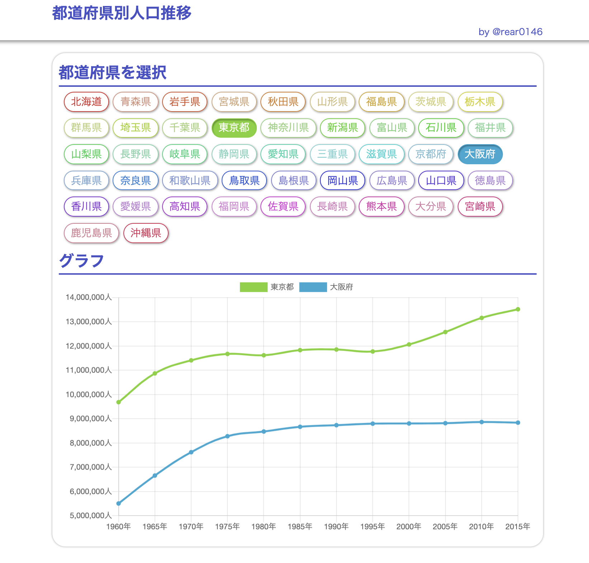

# YumemiCodeCheckSC

[RESAS(地域経済分析システム) API](https://opendata.resas-portal.go.jp/)から動的にグラフを生成



## URL
[Github Pages](https://rear0146.github.io/YumemiCodeCheckSC/)

## 要求仕様
1. RESAS(地域経済分析システム) APIの「都道府県一覧」からAPIを取得する
2. APIレスポンスから都道府県一覧のチェックボックスを動的に生成する
3. 都道府県にチェックを入れると、RESAS APIから選択された都道府県の「人口構成」を取得する
4. 人口構成APIレスポンスから、X軸:年、Y軸:人口数の折れ線グラフを動的に生成して表示する

## 環境変数
RESAS-APIのAPIキーを，プロジェクト直下の.envファイルに記載
```
RESAS_API_KEY = 'xxxxxxxxxxxxxxxxxxxx'
```
## バージョン情報
npm v8.1.2

node v16.13.1

## Build Setup

```bash
# install dependencies
$ npm install

# serve with hot reload at localhost:3000
$ npm run dev

# build for production and launch server
$ npm run build
$ npm run start

# generate static project
$ npm run generate
```

For detailed explanation on how things work, check out the [documentation](https://nuxtjs.org).


